# TNG300 一連の解析：手法・結果・図の読み方

## 全体の問いと結論

問いは「z≈8で M200c≈10^11 Msun のハローは、z=0でどの質量のホストに属するか。その行き先を、中心銀河の性質や周辺環境から絞れるか」である。

保存された結果では、初期質量を狭く揃えても最終ホスト質量には大きな幅がある。中心銀河の星質量・SFRとの順位相関は弱い一方、10–15 cMpc程度の周辺環境は強い情報を持つ。粒子を遡った検証では、このスケールが最終ホストを構成する原始領域の広がりに対応するという解釈と整合する。ただし、最適半径の厳密な決定や形状による説明まで確立したわけではない。

このまとめは5冊のコード・保存済み出力・CSV・保存済み図に基づく。シミュレーションを再実行してはいない。unique descendantについての確率比較のみ、既存CSVから追加集計した。

## 共通の定義

- TNG300-1、snapshot 8（z=8.012173）と99（z=0）。箱の一辺は302.628 cMpc。
- 初期サンプル：10^10.8 < M200c/Msun < 10^11.2、中心subhaloを持つ3,099 FoFハロー。
- M200cは平均内部密度が臨界密度の200倍となる球内の質量。カタログ質量を1e10/h倍し、Msunへ換算する。
- M0は追跡した銀河がz=0で属するFoFホストのGroup_M_Crit200。追跡銀河自身のSubhaloMassではない。衛星になった場合もホストの質量を使う。
- 長さは共動Mpc（cMpc）。位置を1/(1000h)倍し、周期境界を扱う。
- 相関ρはSpearman順位相関。W68はlog10 M0の84パーセンタイル−16パーセンタイル。1 dexは質量の10倍を表す。

## 各ノートブックの手法と結果

### 1. tng300_z8_descendant_mass.ipynb

初期FoFハローの中心subhaloをSubLinkでz=0へ対応付け、snapshot-99のSubhaloGrNrでFoFホストへ変換する。現行コードはonlyMDBのcutoutから唯一のsnapshot-99行を取得する実装であり、DescendantIDを逐次歩くという一部Markdownの説明とは異なる。

3,099/3,099で最終ホストが取得された。log10 M0の中央値は13.779、16–84%は13.012–14.386。質量では6.01×10^13 Msun、範囲は1.03×10^13–2.43×10^14 Msunで、W68=1.373 dex（両端の質量比約23.6倍）。

| z=0ホスト質量 | 初期ハローに対する割合 |
|---|---:|
| <10^13 Msun | 15.75% |
| 10^13–10^14 Msun | 47.73% |
| 10^14–10^15 Msun | 34.17% |
| ≥10^15 Msun | 2.36% |

P(M0>10^14 Msun)=36.53%であり、この初期質量のハローすべてが銀河団になるわけではない。初期質量と最終質量の順位相関はρ=0.115。

3,099初期ハローは1,761の独立した最終FoFホストに対応する。533ホストに複数の初期ハローが入り、最大33個が同じホストへ入る。既存CSVから重複を除いて追加集計すると、最終ホストの中央値は2.40×10^13 Msun、銀河団質量>10^14 Msunの割合は14.99%、>10^15 Msunは0.17%となる。これは初期ハローを1個選んだ場合の確率36.53%、2.36%とは重み付けが異なる。また、独立ホストのサンプルも今回の初期選択に対応するホストに限定され、z=0全ホストの質量関数ではない。

### 2. tng300_descendant_with_galaxy_properties.ipynb

中心銀河の束縛星質量とSubhaloSFRを取得する。周辺銀河数Ngalは、中心銀河位置から5 cMpc以内、Mstar>10^8 Msun、SubhaloFlag=1の銀河を数え、中心自身を除く。順位でほぼ等人数の3群に分け、各群の最終質量分布を比較する。

| 条件 | M0とのρ | 群内W68の標本数加重平均 |
|---|---:|---:|
| 初期質量範囲のみ | 初期質量とのρ≈0.115 | 1.373 dex |
| 中心星質量の3群 | 0.040 | 1.386 dex |
| 中心SFRの3群 | 0.064 | 1.388 dex |
| Ngal(<5 cMpc)の3群 | 0.475 | 1.192 dex |

星質量・SFRで分けても分布の幅はほぼ縮まらない。Ngalで分けると約13.2%縮まり、高Ngal群はlog10 M0中央値14.111、W68=0.966 dexになる。

星質量とNgalをそれぞれ中央値で二分した4群のW68平均は1.245 dex。この分割とNgalの3群分割は群の作り方が異なるため、数値だけで「星質量を追加すると性能が悪化する」とは判断できない。

補助的なRandom Forestでは、同じ最終ホストが訓練・評価の両方に入らないようGroupID_z0で分割。評価RMSEはM8のみ0.650 dex、M8+星質量+SFRで0.627 dex、Ngalをさらに加えると0.560 dex。

### 3. tng300_descendant_with_environment.ipynb

FoFのGroupPosを中心に、半径1,2,3,5,8,10,15,20 cMpcの球内で、銀河数・銀河星質量総和・近隣ハロー数・近隣ハロー質量総和を測る。銀河はMstar>10^8 Msun、近隣ハローはM200c>10^9.5 Msun。対象中心銀河／対象FoF自身をIDで除き、周期KD-treeで集計する。銀河過密度は全箱の平均密度で規格化する。

| 指標 | 試した半径での最大相関 | ρ |
|---|---:|---:|
| Ngal | 15 cMpc | 0.647 |
| 周辺星質量総和 | 10 cMpc | 0.615 |
| Nhalo | 10 cMpc | 0.807 |
| 周辺ハロー質量総和 | 10 cMpc | 0.806 |

Ngalのρは10 cMpcで0.6464、15 cMpcで0.6469とほぼ同じ。銀河環境については「10–15 cMpc付近の広いピーク」と読むのが適切である。

15 cMpcのNgalで分けた低・中・高3群のlog10 M0中央値は13.320、13.740、14.274。W68は1.065、1.093、0.871 dex。加重平均W68=1.010 dexで、基準より0.364 dex、約26.5%縮小する。

初期質量による線形傾向を最終質量から引いても、Nhaloの残差相関は10 cMpcで0.797。環境の相関が狭い初期質量範囲内の質量差だけで生じたとは考えにくい。これは記述的残差検証で、完全な部分相関・因果分析ではない。

Grouped holdoutのRandom ForestではRMSEがM8のみ0.651 dex、Ngalを追加して0.531 dex、周辺星質量総和も加えて0.507 dexとなる。半径の選択自体は全標本で行われており、完全に独立した最適化・性能検証ではない。

### 4. tng300_environment_robustness.ipynb

ハロー閾値log10 M200c=9.5,10,10.5,11、銀河閾値log10 Mstar=7.5,8,8.5,9を比較。さらに投影半径2,3,5,8,10,15 cMpc、視線全長10,20,40,80 cMpcの円柱内で銀河数を数える。視線はシミュレーションz軸で、|Δz|<Llos/2を使う。

ハロー数の最大ρは閾値を上げるにつれて0.807→0.798→0.705→0.520。最適半径は10,10,10,15 cMpc。銀河数では閾値10^8,10^8.5,10^9 Msunでρ=0.647,0.515,0.307。高閾値では近隣ゼロの割合が増え、環境の識別力が落ちる。Mstar>10^7.5 Msunではρ=0.764だが、これは分解能を厳しく試す条件で、完全な銀河標本と扱えない。

最良の円柱はRproj=10 cMpc、Llos=20 cMpcでρ=0.662。球の0.647より0.015大きいが、形状・体積も異なるため投影そのものが改善を保証する結果ではない。高円柱密度群ではW68=0.828 dex、P(M0>10^14)=72.70%、P(M0>10^15)=6.00%。

解析的なラグランジュ半径は R_Lag=[3M0/(4πρbar_m,0)]^(1/3)。中央値7.146 cMpc、16–84%は3.967–11.384 cMpcで、全体の最適ハロー環境半径10 cMpcは中央値の1.40倍。最終質量群ごとの最適半径は2,5,8,15,20 cMpcと増える。ただし、この分割には既知のM0を使うので、未知の最終質量を観測から推定するための半径選択規則ではない。最高質量群の20 cMpcは探索上限であり、ピーク位置の確定には半径拡張が必要である。

### 5. tng300_protohalo_lagrangian_regions.ipynb

各独立最終ホストについて、最も重い選択済みz≈8前駆体を代表とする。log10 M0=12.5–13.5,13.5–14,14–14.5,>14.5から20ホストずつ、計80を固定seedで抽出する。M0<10^12.5 Msunの群は含まない。

z=0 FoFのDM粒子をR200c内に制限し、ParticleIDをハッシュで各1万粒子に抽出。snapshot 8で同じIDの位置を照合する。全80ホストで1万粒子、照合率100%。冒頭Markdownには上限10^5粒子とあるが、実行コード・出力・CSVでは10^4粒子である。

周期座標の円平均を中心にR50,R68,R80,R90,Rrmsを測定し、位置の共分散テンソルから軸比b/a,c/aと三軸度Tを求める。初期対象ハローを中心とした球内に入る「将来の最終ホストDM粒子」の割合fprogも測定する。

R90/R_Lag中央値=1.040、16–84%は0.979–1.143、順位相関ρ=0.979。R50はR_Lagの約0.716倍であり、半質量半径より外側まで含むR90が解析的スケールに近い。過去の環境最適半径に最も近い粒子半径もR90で、中央値の絶対差は2.00 cMpc。

形状中央値はb/a=0.820、c/a=0.671、T=0.627で、球形からずれる。しかしRopt/R_Lagとc/aの相関はρ=0.124、p=0.274で、細長さが大きいほど相対的に大きな開口が必要、という説明を支持する明瞭な傾向はない。Roptは各質量群の値を割り当てており、個々のホストで独立に最適化してはいない。

割り当てたRopt内のfprogは中央値89.8%、16–84%は60.3–99.1%。これは今回抽出した将来のR200c内DM粒子の捕捉率であって、開口中の全粒子が将来そのホストに入る割合（純度）ではない。全体の環境数と粒子半径の相関ρ≈0.75は、同じ最終質量に依存する効果も含み、質量群内では概ね弱くなる。

## 注目すべき図と読み方

以下のCell番号はノートブック内の見出し番号。protohaloでは節番号を使う。

### A. 最優先：環境の情報量と最終質量分布

出典：descendant_with_environment、Cell 23「main summary figure」。

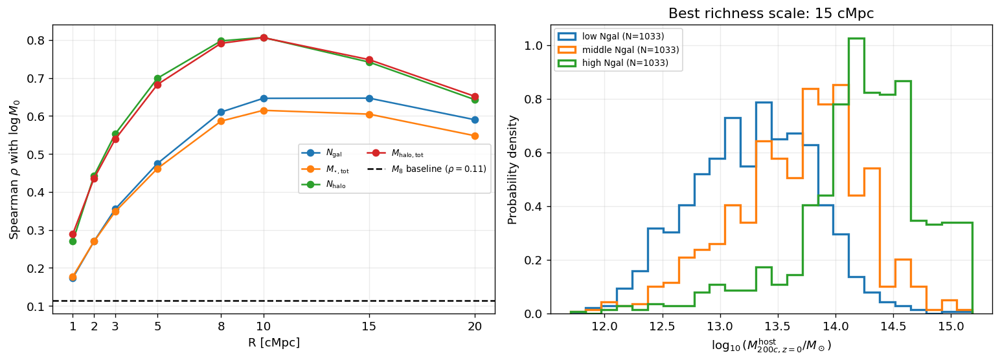

左は半径Rに対する順位相関。10–15 cMpc付近で最大となり、20 cMpcでは低下すること、NhaloがNgalより高いこと、初期質量の破線を大きく上回ることを見る。相関係数は説明分散の割合ではない。右は15 cMpcの銀河数3群による規格化質量分布。豊かな環境ほど右へ移り、幅が縮むが、曲線同士の重なりは残る。

### B. 出発点：最終ホスト質量の広い分布

出典：z8_descendant_mass、Cell 12「descendant host-mass distribution」、Cell 14「survival function」。

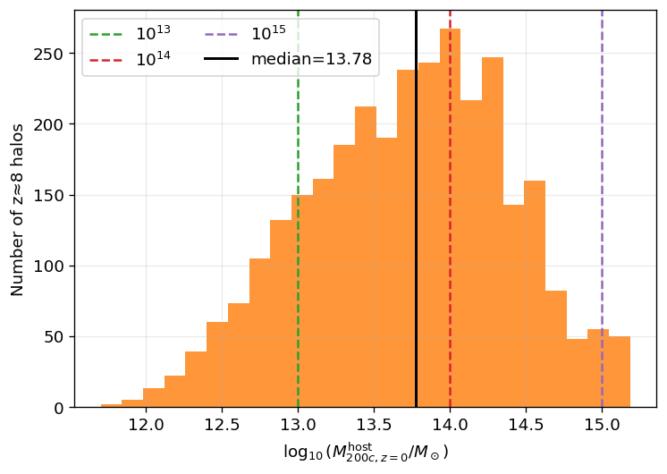

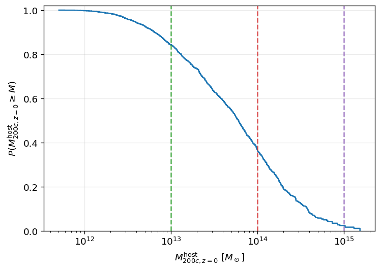

ヒストグラムは狭い初期質量に対して最終質量が広いことを示す。生存関数は横軸の閾値を上回る割合を縦軸から読む。10^14 Msunで36.5%、10^15 Msunで2.36%。縦軸の母集団は選択された初期ハローである。

### C. 中心銀河だけでは絞りにくい

出典：descendant_with_galaxy_properties、Cell 19「final comparison figure」。

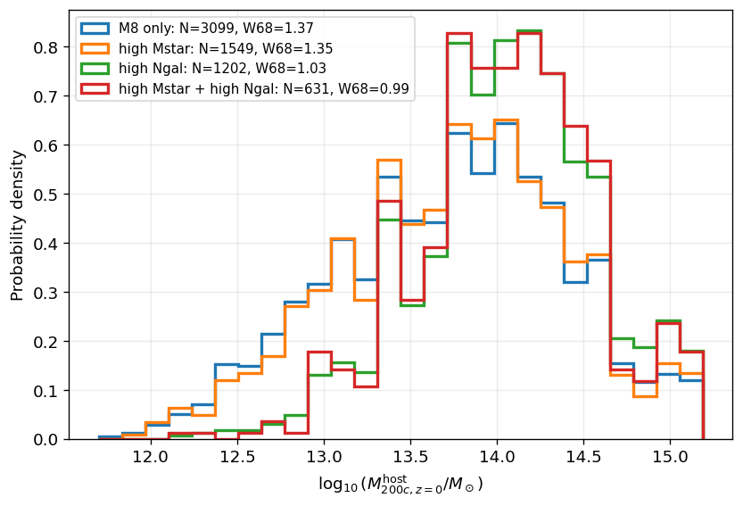

基準分布とhigh Mstarの重なり、high Ngalの高質量側への移動を見る。縦軸は確率密度なので、高いピークは標本数の多さではなく分布の集中を表す。各群は重なりを持つ選択である。

### D. 閾値依存性

出典：environment_robustness、「Optimal radius and maximum correlation versus threshold」。

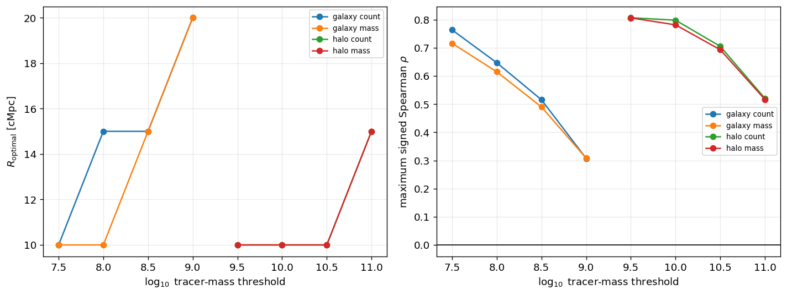

左は最適半径、右は最大相関。高閾値ほど相関が低下し、最適半径が大きくなる傾向を読む。検出できる明るい銀河だけでは近隣ゼロが増えることが重要。10^7.5 Msunの高相関には分解能限界がある。

### E. 投影を導入しても信号は残る

出典：environment_robustness、「Cylinder heatmap and projected-radius curves」。

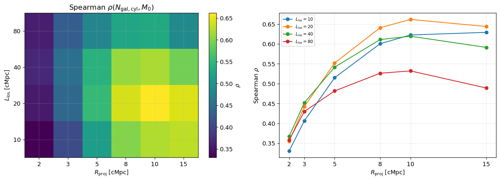

左の横軸は投影半径、縦軸は視線全長。明るい色ほど相関が強い。右は奥行きごとの曲線。Rproj≈10 cMpc、全長20 cMpcで最も高く、全長80 cMpcでは低下する。真の3D位置に幾何学的な円柱を適用した実験であり、測光赤方偏移誤差や観測選択まで模擬してはいない。

### F. 環境スケールの物理的解釈

出典：protohalo_lagrangian_regions、節10「Compare particle-defined sizes with analytic R_Lag」、節11「Descendant-mass dependence and environmental optimal radius」。

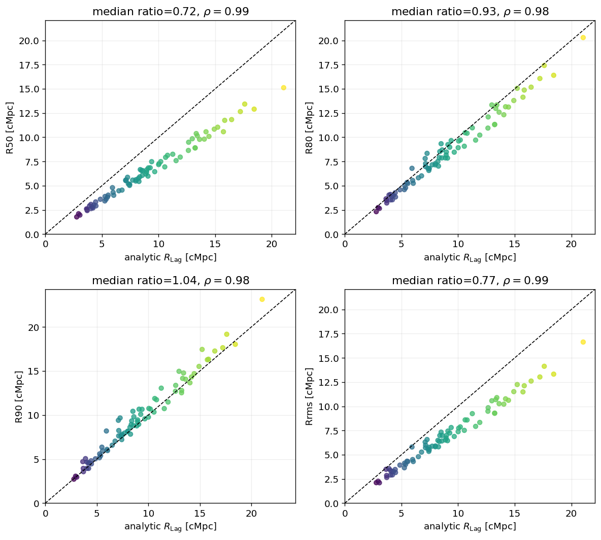

左下R90が1:1線に近い。高い順位相関だけでなく、半径比が1に近いことが対応の根拠。R50・Rrmsも高相関だが、系統的に小さい。

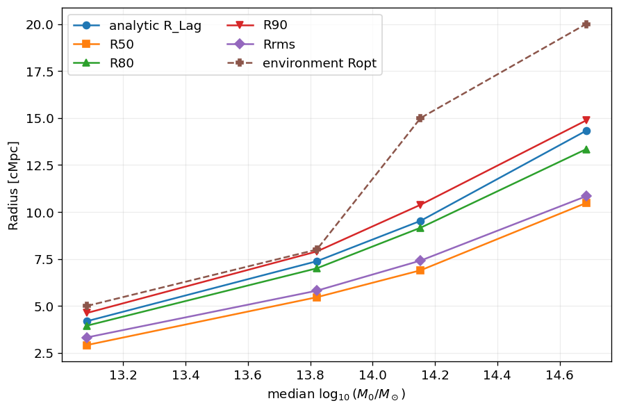

質量が増えるほど全半径が増えること、RoptがR90に近いものの高質量側では上に出ることを見る。「一致」より「同程度のスケール」と評価する。

### G. 形状と中心のずれ

出典：protohalo_lagrangian_regions、節13「Representative proto-halo visualizations」。

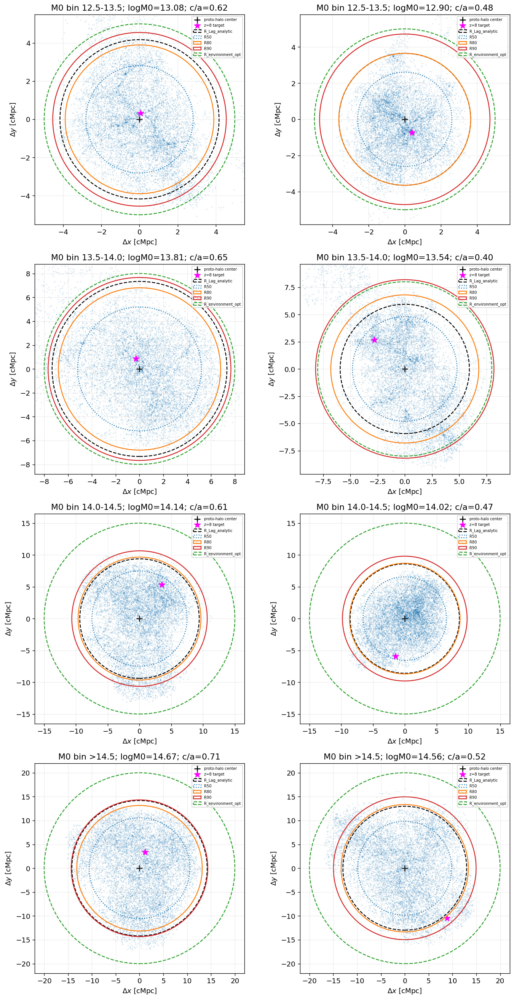

点は将来同じ最終ホストのR200c内に入るDM粒子。黒＋が原始領域中心、紫星が選択したz≈8ハロー。非球形や中心のずれを見る。赤円はR90、緑破線はRoptだが、どちらもこの図では原始領域中心に置かれている。実際の環境開口は対象ハロー中心なので、図の円から捕捉率を直接読まない。xy投影図の円内に見える粒子が3D球内にあるとも限らない。全パネルの物理スケールは同一ではない。

### H. 対象ハロー中心でどれだけ原始領域を含むか

出典：protohalo_lagrangian_regions、節15「Fraction of eventual descendant particles inside target-centered apertures」。

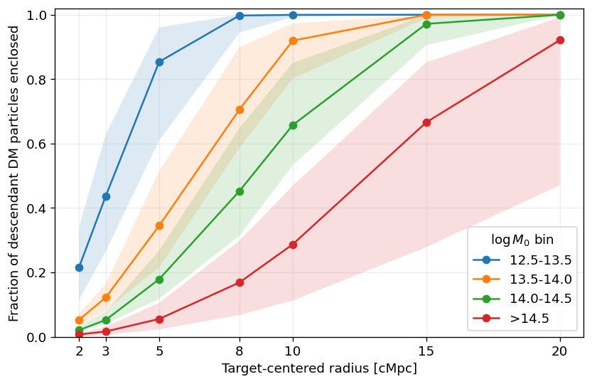

横軸は対象ハロー中心の開口半径、縦軸は将来の最終ホストDM粒子の捕捉率。線は各質量群の中央値、帯はホスト間の16–84%範囲で、中央値の誤差ではない。高質量群は小開口では捕捉率が低く、より大きな開口が必要。これは環境スケールの解釈を支えるが、開口の純度は測っていない。

### I. 個数比較での重複

出典：z8_descendant_mass、Cell 17「one representative progenitor per unique descendant」。

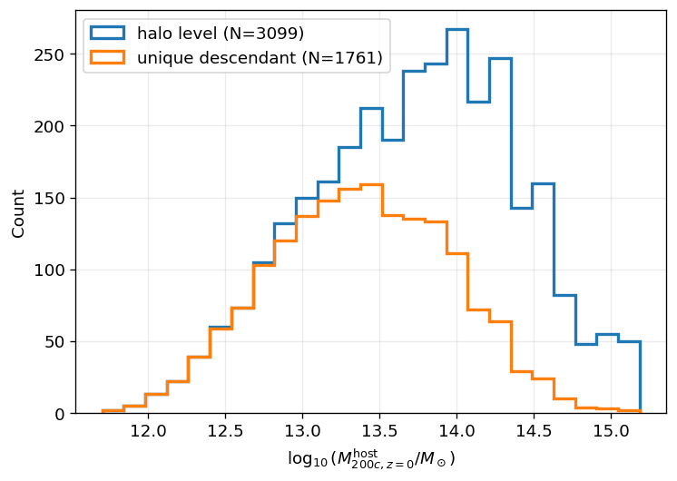

高質量側でhalo levelとunique descendantの差が大きくなることを見る。曲線は未規格化の個数なので、総数の違いと形の違いを区別する。初期構造の個数をz=0銀河団の個数と比較する際に必須の図である。

## 結論の適用範囲

1. 「環境が中心銀河より情報を持つ」は、今回の狭い初期ハロー質量範囲内での結果。広い初期質量範囲に一般化しない。
2. 最適半径・円柱条件は同じ標本で探索したグリッド内の最大値。10 cMpcと15 cMpcの差、球と円柱の0.015差には独立検証や不確かさ評価が必要。
3. 3群は順位により等人数化され、同じNgalの値が境界の両側に入る場合がある。低・中・高群を厳密に一意な観測カットとみなさない。
4. W68はシミュレーション内の条件付き分布幅で、観測した1天体の較正済みBayesian posteriorではない。
5. 初期ハローは共通の最終ホストや共通の大規模構造を持つ。通常の相関p値・Wilson区間はその依存性や宇宙分散を十分には反映しない。回帰のgroup分割は共通ホストの漏洩を防ぐが、空間的独立性までは保証しない。
6. 粒子検証は質量群ごと等数の80ホスト・各1万粒子であり、全標本を自然な頻度で重み付けした解析ではない。粒子数・ホスト数・中心定義を変えた収束検証が残る。
7. 観測へ適用するには、赤方偏移誤差、検出限界、interloper、マスク、選択関数、測定誤差を含む前向きモデルが必要。
